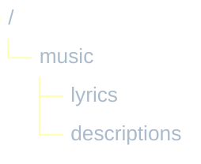

# My-Prompts

Just a collection of prompts I use.

I try to organize them in different folders. They represent the answers to the questions:

1. What is it for?
2. What does it generate?

```mermaid
---
config:
    treeView:
        rowIndent: 16
        lineThickness: 1
    themeVariables:
        treeView:
            labelFontSize: '14px'
            labelColor: '#abc'
            lineColor: '#ffa'
---
treeView-beta
    "music"
      "lyrics"
      "descriptions"
```
